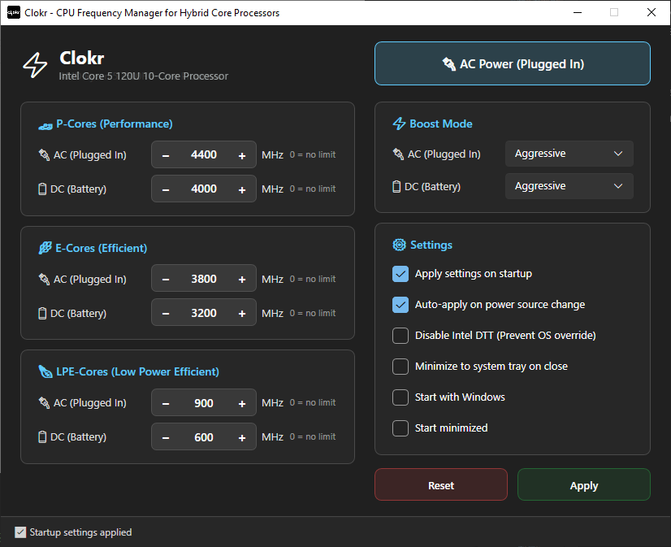

  

# Clokr
CPU Frequency Manager for modern hybrid systems (Intel Core Ultra, Alder/Raptor Lake, etc.) on Windows.

Clokr was originally developed as a tool to conveniently find the optimal CPU frequency on laptops, helping to balance performance and temperature for a cooler and quieter experience.

## Download

You can find the latest pre-compiled binaries in the **[Releases](https://github.com/hadoooooooouken/Clokr/releases)** section.

## Key Features

*   **Smart Topology Detection**: Automatically identifies your CPU architecture (Intel Core Ultra, Alder/Raptor Lake, AMD, etc.) and adjusts the UI and mapping accordingly.
*   **Per-Core Class Management**: Set maximum frequency (in MHz) for different core classes, with automatic mapping based on detected topology:
    *   **Intel Core Ultra**: Maps Class 2 to P-Cores, Class 1 to E-Cores, and Class 0 to LPE-Cores.
    *   **Intel Hybrid (Alder/Raptor Lake)**: Maps Class 1 to P-Cores and Class 0 to E-Cores.
    *   **AMD / Traditional CPUs**: Provides a single control for all cores.
*   **Power Profiles**: Independent limit settings for **Plugged In (AC)** and **On Battery (DC)** modes.
*   **Turbo Boost Control**: Choose Processor Performance Boost modes (Disabled, Aggressive, Efficient, etc.).
*   **DTT Suppression**: Option to disable **Intel Dynamic Tuning Technology** and **Innovation Platform Framework**. This prevents automatic frequency resets by OEM services that often override Windows settings, a behavior particularly aggressive when running on **battery**.
*   **GUI Unlocker**: Automatically makes hidden power parameters visible in the standard Windows "Power Options" control panel.
*   **Autostart (Optional)**: Integration with Task Scheduler for automatic startup on login with administrative privileges. Note that **background execution is not mandatory**; once settings are applied, they persist in the Windows power scheme, allowing you to close the application.

## How It Works

Clokr is not a driver and does not perform direct overclocking via CPU registers. Instead, it leverages native Windows mechanisms:

1.  **PowerCfg**: The application interacts with the `powercfg.exe` system utility to modify parameters of the active power scheme. It manipulates the following setting indices:
    *   `75b0ae3f-bce0-45a7-8c89-c9611c25e100` (PROCFREQMAX)
    *   `75b0ae3f-bce0-45a7-8c89-c9611c25e101` (PROCFREQMAX1)
    *   `75b0ae3f-bce0-45a7-8c89-c9611c25e102` (PROCFREQMAX2)
    *   `be337238-0d82-4146-a960-4f3749d470c7` (PERFBOOSTMODE)
2.  **DTT Management**: To combat aggressive thermal throttling, the program uses `pnputil` to programmatically disable Dynamic Tuning devices in Device Manager and `sc` to stop and disable corresponding system services.
3.  **Registry**: To display hidden settings in the Windows interface, Clokr changes the `Attributes` value to `2` in the relevant registry keys under `HKEY_LOCAL_MACHINE\SYSTEM\CurrentControlSet\Control\Power\PowerSettings\...`.
4.  **Topology Detection**: On startup, Clokr detects the processor model via WMI and determines the number of efficiency classes. It dynamically shifts the mapping of `PROCFREQMAX` (0, 1, 2) to match the hardware (e.g., ensuring P-Cores are correctly identified on both Meteor Lake and Alder Lake systems).

## ⚠️ Important: Disabling Intel DTT

Intel Dynamic Tuning Technology (DTT) is a system-wide power and thermal management solution. Disabling it may lead to the following side effects:
*   **Inaccurate Thermal Management**: The system may not respond as quickly to thermal events. While hardware-level protections (T-junction) remain active, the software-level predictive cooling may be disabled.
*   **Reduced Battery Life**: DTT often manages power consumption dynamically. Without it, your laptop may consume more power in certain scenarios.
*   **Loss of OEM Features**: Many laptop manufacturers (ASUS, Dell, Lenovo, etc.) rely on DTT for their custom power modes (e.g., "Silent", "Extreme Performance"). These modes may stop functioning correctly.
*   **Fan Control Issues**: In some systems, fan curves are tied to DTT telemetry.

## Build

The project uses the modern **.slnx** solution format and requires:
*   **Visual Studio 2026** (or newer) or **JetBrains Rider**.
*   **.NET 10.0 SDK**.

## Requirements

*   Windows 10 or 11.
*   [.NET 10.0 Desktop Runtime](https://dotnet.microsoft.com/en-us/download/dotnet/thank-you/runtime-10.0.7-windows-x64-installer) (version 10.0.7 or newer).
*   Administrator privileges (required for `powercfg`, registry, and service management).

## Disclaimer

**USE AT YOUR OWN RISK.** This software is provided "as is" without warranty of any kind. The author assumes no responsibility for any damage to your hardware, data loss, or any other issues resulting from the use or misuse of this tool. Modifying power settings and disabling system services can lead to system instability or hardware overheating.

## License
MIT
